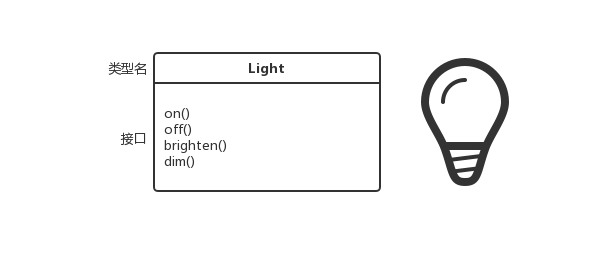

# 对象导论

> “人们将自然分解，组织成各种概念，并按其含义分类，主要是因为我们是整个语言交流社会共同遵守的协定的参与者，这个协定以语言的形式固定下来。除非赞同协议中规定的有关语言信息的组织和分类，否则人们无法交流。”-Benjamin Lee Whorf(1897-1941)

## 抽象过程

所有的编程语言都提供抽象机制。可以这么认为，解决问题的复杂性取决于抽象的类型和质量。抽象的“类型”可以是指“抽象的是什么”，**汇编语言(Assembly Language)**是对于底层机器的轻微抽象。**命令式语言(Imperative Language)**(如FORTRAN，BASIC，C)又是对汇编语言的抽象，这些语言相比较汇编语言有了很大的进步，但是所做的主要抽象仍然基于计算机结构，而不是要解决的问题的结构来考虑。程序员必须建立起**机器模型**(位于“解空间”，实现解决方案的空间，如计算机)与实际要解决的**问题模型**(位于“问题空间”，问题存在的空间，如某项业务)之间的联系。执行此映射需要很大的工作量，并且对于编程语言而言属于外在功能，使得程序难以编写且维护成本高昂，产生了整个“编程方法”副产业。

机器建模的替代就是针对待解决问题建模。早期的编程语言如LISP和APL选择将问题都看成世界的某些特定方面(“所有的问题最终可以看成列表”或者“所有问题都可以看成算法”)，Prolog将所有的问题都转换成决策链。此外还产生了基于约束条件编程和通过操纵图形符号编程的语言。所有这些方式对于所要解决的特定问题是一种比较好的解决方式，但一旦超出其特定领域便无能为力了。

面向对象方式通过为程序员提供问题空间表现元素的工具更进了一步，这种表示方式比较通用，不再受限于任何特定类型的问题。我们将问题空间中的元素及其解空间中的表现称为“对象”(有些对象在问题空间不存在对应类似物)。这种思想的实质在于：**程序可以通过添加新类型对象来自适应问题描述，所以在阅读解决方案代码的同时也是在阅读问题描述**。相对于之前使用的语言，这是一种更灵活强力的语言。OOP根据问题而不是运行解决方案的计算机来描述问题。当然其与计算机仍然有一些联系：**每个对象看起来就像是一个微型计算机，有状态，有要求执行的操作**。与现实世界中的对象类比，它们都有特征和行为。

Alan Kay曾经总结了Smalltalk的5个基本特征，Smalltalk是第一个成功的面向对象编程语言，同时也是Java语言所基于的语言之一。这些特征表达了一种纯粹的面向对象编程语言：

1. **万物皆为对象**。将对象想象成一个变量，可以存储数据，也可以请求对象自身执行某些操作。理论上讲，可以将待解决问题中的任何概念化组件(狗，建筑，服务等)抽取出来，并在程序中表示为对象。
2. **程序是对象的集合，对象之间通过发送消息来告诉彼此要做的事情**。通过向对象“发送消息”就可以对其作出请求，更具体的讲，可以将消息当成调用某个对象方法的请求。
3. **每个对象都有由其他对象组成的自己的存储**。换一种方式讲，通过创建包含现有对象的包可以创建新的类型的对象。因此，在程序中可以构建复杂的体系，同时将复杂性隐藏在对象的简单性背后。
4. **每个对象都有类型**。按照这个说法，每个对象都是类的实例。这里“类”就是“类型”的代名词，类之间最重要的区别在于“可以发送什么样的消息？”。
5. **某一特定类型的所有对象都可以接受相同的消息**。比如说，“圆形”对象也是一种“几何形”对象，那么“圆形”对象也就可以接受“几何形”类型对象的消息。这意味着可以编写与几何形交互的代码，并且在所有的与几何形相关事物中能够根据自身情况自动处理相关消息。这种**可替代性(substitutability)**是OOP编程中一种强大的概念。

Booch为对象提供了一种更简洁的描述：**对象具有状态，行为和标识**。这意味着对象都有内部数据(给出了对象状态)，方法(产生行为)，并且每个对象都可以与其他对象区分开来，即每个对象在内存中都有一个唯一地址。

## 每个对象都有接口

亚里士多德大概是第一个深入研究*类型(type)*的哲学家，他提出了鱼类和鸟类这样的概念。所有的对象都具有唯一性，但也同时是具有相同特征和行为对象类的一部分，这一思想直接运用在第一门面向对象语言Simula-67上，在程序中使用**class**关键字来引入新的类型。

Simula，就像其名字一样，是为了开发如“银行出纳员问题”之类经典的仿真程序而创建的。在该类问题中，有出纳员，顾客，账户，交易和货币单位等对象。在程序执行期间除了状态之外其他方面都相同的对象都归为同一种类型，这就是**class**关键字的由来。创建抽象数据类型(类)是面向对象编程中的一种基本概念，抽象数据类型的工作方式与内置类型几乎完全一致：可以创建某一类型的变量(按照面向对象的说法，称其为*对象*或*实例*)，并且能够操作这些变量(称为*发送消息或请求*)。每个类成员或元素都具有某些共性：每个账户都有余额，每个出纳员都可以处理存款请求等。除此之外，每个类成员都有其自身状态：每个账户都有不同的余额，每个出纳员都有不同的名字等。因此，出纳、顾客、账户、交易等在计算机程序中都可以表示成唯一的实体，这些实体就是对象，每个对象都属于某个定义了特征和行为的特定类。

类描述了具有相同特征(数据元素)和行为(功能)的对象集合，因此类就是一种数据类型。面向对象编程中，程序员可以根据问题需要添加新的自定义类，而不是使用已经存在的表示机器存储单元的数据类型，系统能够接受新的数据类型并能够像内置类型一样进行类型检测。

面向对象编程不止局限于仿真程序，无论设计多么复杂的系统，通过OOP都能够分解成一系列简单的解决方案。

类一旦建立，可以根据需要创建该类的任意个对象，然后就可以像存在于待解决问题中的元素一样操纵这些对象。实际上，面向对象编程中的一个挑战就是将问题空间中的元素与解空间中的对象一一映射。

对于对象而言，需要有一种方法来对对象进行请求，以便其能够执行某些操作，如完成交易，在屏幕上画图，打开开关等。每个对象都只能满足某些请求，这些请求可以使用对象的*接口(Interface)*定义，决定接口的便是类型。以电灯泡做一个简单的比喻：



```java
Light lt = new Light();
lt.on();
```

接口决定了某一类特定对象所能发送的请求，在程序中必须有代码来实现这些请求。这些与隐藏的数据一起构成了*实现(Implementation)*。类型中，每个请求都会与一个方法进行关联，向对象发送请求时，与之关联的方法被调用。这个过程被概括为：向某个对象“发送消息”(产生请求)时，该对象就明白了消息要做的事情，执行相应程序代码。

在以上的代码中，**Light**是类型/类，**lt**是Light类new出来的对象，通过lt调用on()/off()/brighten()/dim()能够向灯泡发送关闭/打开/调亮/调暗请求。前面的图是*UML(Unified Modeling Language)*形式的图。

## 对象提供服务

当试图开发或者理解程序设计时，最好的方式之一是将对象当成“服务提供者”。程序通过使用对象提供的服务来向用户提供服务，开发者创建甚至使用已有的一系列提供理想服务的对象来解决问题。

如果可以将问题抽象出来，首先需要做的就是想清楚什么样的对象能够马上解决这个问题。比如说，假设你想创建一个簿记程序，可以想像系统应该具有某些预定义的簿记输入屏幕对象，执行簿记计算的对象集合，一个在不同打印机上打印支票和发票的对象。可能已经存在某些对象，对于不存在的对象，看起来是怎样的呢？这些对象能够提供哪些服务？需要哪些对象支持才能履行义务？持续这个步骤，最终能够达到“对象足够简单，可以开始编码”，“已经确定所有的对象已经存在”，这是一种将问题分解为一组对象的合理方式。

将对象看成服务提供者还能够提高对象的凝聚力。*高内聚*是软件设计的一种基本原则，这意味着一个软件构件的各个方面都组合的很好。在设计对象时常遇到的一个问题就是将过多的功能都塞到一个对象中。比如说，在检测打印模块中，你可能需要一个了解所有格式和打印方法的对象。但是这些方法对于一个对象来说太多了，更合理的需求是可能需要一个了解所有支票排版目录的对象，可以查询如何打印支票相关信息；一个或者一组了解所有不同打印机信息的通用打印接口对象；使用这些对象服务完成任务的对象。这样，每个对象都有其提供的服务内聚集合。在好的面向对象设计中，每个对象都只执行一项任务，不需要太多。

将对象当成服务提供者是一种好的简化方式。这种方式不仅在设计阶段有用，在其他人理解你的代码或者重用对象时同样有用。如果他们能够看出对象提供的服务价值，就能更简单的将对象适应程序设计。

## 隐藏的具体实现

将开发人员按照角色分为*类创建者*(创建新的数据类型的开发者)和*类消费者*(在应用中使用已有数据类型的开发者，也称为客户端程序员)是一种很有用的做法。客户端程序员的目标是收集各种能够快速开发的类；类创建者的目标是构建类，只向客户端程序员暴露必要的部分，隐藏其他实现。这样使得客户端程序员不能访问具体的实现逻辑，这意味着类创建者能够任意修改隐藏的实现逻辑，不用担心会对其他人造成影响。隐藏的实现部分通常代表对象内部脆弱的部分，容易被粗心或者不知情的客户端程序员损坏，因此将实现隐藏起来能够减少bug。

在任何相互关系中，有关系所涉及的各方遵守的边界是很重要的。当你创建一个库，就与客户端程序员建立了联系，他们是使用你的库来构建应用或者更大的库程序员。如果类的所有成员对于任何人都是可见的，客户端程序员就能够无任何约束的使用该类做任意事。即便你希望客户端程序员不要直接操控类中的某些成员，在没有任何访问控制情况下无法阻止这种情况。访问控制存在的原因有以下几点：

- 控制客户端程序员无法触及他们不应该触碰的部分(这部分对于数据类型的内部操作是必要的，但不是用户解决问题所需接口的一部分)。这对于客户端程序员来说是一项服务，这样使得他们能够很轻易的看出对于他们哪些是重要的哪些是应该忽略的。
- 保证库的设计者在修改类的内部工作方式时无需担心是否会影响到客户端程序员。如果能够清晰的分离并保护接口和实现，就能够很容易的实现访问控制。

Java使用3个关键字来限定类的边界：**public**，**private**和**protected**。这些*访问限定符(Access Specifiers)*决定了其定义的东西的访问范围。**public**意味着对于所有人都可访问；**private**表示除了类型创建者和类型的内部方法之外，其他任何人访问private成员会在编译时得到错误信息；**protectd**与private类似，差别在于类的继承者能够访问**protected**成员，但是不能访问**private**成员；除此之外，java还有一种默认的访问权限，没有使用任何*访问限定符*时就是默认的访问权限，也被称为**包访问权限(Package Access)**，能够被同一个包中的其他类访问，但是在不同包中时与private类似。

## 复用具体实现

一旦类被创建并测试完成，就应该代表一个有用的代码单元。事实证明，这种复用性并没有那么容易达到我们期望的程度；产生一个可复用的对象设计需要丰富的经验和敏锐的观察力。代码复用是面向对象编程提供的最好的优点之一。

最简单的复用方式是直接使用某个类的对象，除此之外还可以将对象放到某个新的类中，我们称其为“创建成员对象”。新的类可以由任意数量、任意类型的其他类型对象组成，可以根据功能需要以任意的组合形成新的类。这种使用已有的类组成新的类的方式称为“**组合(composition)**”，如果组合是动态发生的通常称为“**聚合(aggregation)**”。组合经常被视为“**has-a**”关系，类似于“汽车拥有一个引擎”。


组合带来了极大的灵活性，将新类的成员对象声明为private，这在客户端程序员使用该类时对其不可访问。这就允许你在不影响现有客户端代码的情况下改变成员对象，也可以在运行时改变成员对象来动态改变程序行为。**继承(Inheritance)**就没有这种灵活性，因为编译器必须对继承创建的类施加编译时限制。

继承在面向对象编程中很重要，经常被高度强调，因此新手程序员就觉得处处都应该使用继承，这就产生了很多很难使用并过于复杂的设计。实际上，在创建新类时应该首先考虑使用**组合**，因为它更加简单灵活。

## 继承(Inheritance)

对象允许通过*概念(concept)*将数据和功能封装在一起，因此可以将问题空间使用表适当的观念来表示而不用受制于底层语言。这种概念在编程语言中使用**class**关键字作为基本单位表示。

类型不只是描述了作用于对象集合的约束条件，也描述了与其他类型之间的关系。有两种相似特征行为的类型，其中一种类型比另一种类型拥有更多的特征，如可以处理更多的消息，**继承(inheritance)**通过基类和子类来表示了这种关系。如果A继承自B，A就可以称为B的*子类*，B称为A的*父类(超类，基类)*。继承可以使得子类具有父类的非私有属性和方法，不需要再次编写相同的代码，从而达到可重用性。子类在继承父类的同时，可以重新定义某些属性和方法或者添加新的属性或方法。从而获得与父类不同的功能。


使用继承不仅让子类获得了父类的所有成员，更重要的是其继承了基类的接口。也就是说，所有发送给基类对象的消息也可以发送给子类对象，这意味着*子类与基类具有相同的类型*。

## Is-a与Is-like-a关系对比

人们根据对继承的理解引发了一场争论：继承是否应该只重写基类的方法(不应该在子类中添加基类没有的方法)？如果这样做就意味着子类与父类是两种完全相同的类型，因为它们具有完全相同的接口。这样做的结果就是子类对象完全可以替代基类对象，这是一种*纯粹替代*思想，通常称之为*替代原则(substitution principle)*。从某种意义上说，这是一种理想的继承方式。我们通常将这种关系下的子类和父类称为*is-a*关系。想要判断两个类是否具有继承关系，就可以通过判断两个类之间的*is-a*关系是否有意义来确定。比如说，“一个圆形就是一个几何形状”这种说法是正确的，因此它们之间可以构成继承关系。

有时必须在子类中添加新的接口元素，从而就扩展了接口。这种新的类型仍然可以替代基类，但是这种替代是不完美的，因为基类无法访问新添加的方法，这种情况下就可以称之为*is-like-a*关系。子类具有基类的接口，但也包含其他方法，因此不能说它们完全相同。以空调为例，假设房间里已经布线安装好了所有的冷气设备控制器，也就是说房子具备了让你控制冷气设备的接口。加入空调坏了，你想用一个既能制冷又能治热的热力泵替换空调。那么这个热力泵就类似于空调(is-like-a)，但是它可以做更多的事。因为房子的控制系统被设计成只能控制冷气设备，所以它只能和新对象中的制冷部分进行通信。尽管新对象的接口已经被扩展了，但是现有系统除了原有接口之外对其他东西一无所知。


当然，看过上面的设计之后很容易发现"Cooling System"这个基类不够一般化，应该将其更名为"Temperature control system"，并包含加热功能，这样就可以套用替换原则。因此，在设计类继承时，我们需要不断审视，使得基类一般化。

## 多态泛化对象

在处理类型的层次结构时，通常想把对象当成其基类的对象而不是它所属的具体类型来看待，这使得开发者能够编写出不依赖于具体类型的代码。如，在Shape中，方法操作的都是泛化的形状，不关心具体是圆形、正方形、三角形还是其他形状。所有的形状都能够绘制、擦除和移动，这些方法都是直接对几何形对象发送消息，不需要关心对象将如何处理消息。

这样的代码是不受新添加的继承自基类的新类型的影响，添加新类型是面向对象中扩展处理新情况最常用的方式。如，从几何形中派生出一个新的子类型“五角形”，不需要修改处理泛化几何形的代码。通过派生新的子类型从而轻松扩展设计是应对封装变化最基本的方式之一。这极大的提高了设计，同时也降低了软件维护成本。

在泛化方法中，编译器在编译时并不知道哪部分的代码会被执行。比如说，发送一条形状绘制的消息，编译器并不知道哪种形状会响应这条消息，可能会是圆形、正方形或者三角形等响应draw()方法，对象会根据自身具体的类型来执行正确的代码。通过这种泛化的方式，在添加新的子类型时，不需要对泛化代码做任何调整就能正确的响应具体方法。如下图所示，**BridController**只是处理泛化的**Bird**对象，并不知道对象的具体类型。从**BridController**的角度而言，它并不需要编写具体的代码来决定**Bird**对象具体的类型和行为。当调用**move()**方法时即便忽略掉**Bird**的具体类型，也能够产生正确的行为(**Goose**走，飞或者游泳，**Penguin**走或者游泳)。


这就是面向对象设计最重要的部分：编译器不会产生传统意义上的函数调用。非面向对象编程产生的函数调用会造成**前期绑定(early binding)**，这意味着编译器将产生一个具体函数名字的调用，运行时系统将这个调用解析成具体要执行的代码绝对地址。在面向对象编程(OOP)中，程序直到运行时才能够确定代码的地址，因此当消息发送给泛化对象时必须采用其他机制。

为了解决这个问题，面向对象语言采用了**后期绑定(late binding)**的概念，当向对象发送消息时，要执行的代码直到运行时才能确定。编译器只保证被调用的方法存在，并对调用参数和返回值执行类型检查，但是不知道要执行的确切代码。

为了完成后期绑定，Java使用了一小段特殊的代码来代替绝对地址调用。这段代码使用存储在对象中的信息来计算方法体的地址。因此，根据这一小段代码每个对象都可以具有不同的行为表现。当向对象发送消息时，对象就能明白应该怎样处理这条消息。

在某些语言中，方法默认情况下并不是动态绑定，如果想要某些方法具有后期绑定属性，必须进行明确声明(如C++使用**vitual**关键字)。在Java中，动态绑定是默认的行为，不需要添加任何关键字。

```java
void doSomething(Shape shape){
    shape.erase();
    //...
    shape.draw();
}

public static void main(String[] args) {
    Circle circle = new Circle();
    Triangle triangle = new Triangle();
    Line line = new Line();
    doSomething(cicle);
    doSomething(triangle);
    doSomething(line);
}
```

在以上代码中，将Circle/Triangle/Line看成是Shape基类，这种将子类当作基类的过程叫做**向上转型(Upcasting)**。向上转型来源于继承图的典型布局方式：基类在上，子类在下，子类转化为基类即向上转型。


## 单根继承结构

在OOP领域，自C++面世以来就变得特别瞩目的一个问题就是：所有的类是否最终都应该继承自单一的基类？在Java中，采用的是单根继承结构，所有的类最终都继承自**Object**。

单根继承结构的所有对象都有共同的接口，所以它们归根结底都是相同的基本类型。另一种结构(如C++)是无法保证所有的对象都属于同一个基本类型。从向后兼容性角度来看，这样能够更好的适应C模型，并且受限很少，但是如果想要进行完全的面向对象程序设计时就必须构建自己的继承体系，以便能够提供像其他OOP语言一样的便利。并且在所获得的任意新库中，总会用到一些不兼容的接口，需要花大力气来使得新的接口能够融入你的设计。

单根继承结构能够保证所有对象都具有某些功能，所有对象都可以很容易在堆上创建，参数传递也得到了很大的简化。单根继承结构还使得**垃圾回收器(garbage collector)**的实现变得容易，这是Java相对于C++重要的改进之一。因为所有对象都保证具有类型信息，不会因无法确定对象的类型而陷入僵局。这对于系统级的操作(如异常处理)极为重要，并且给编程带来了更大的灵活性。

## 容器

通常来讲，如果不知道解决一个具体的问题需要多少对象或者它们将存活多久，那么就不知道应该如何存储这些对象。那么在运行时才能了解的信息，该如何确定创建这些对象需要多少空间呢？

在面向对象设计中对于这类问题的大多数解决方案似乎比较草率：创建另外一种类型的对象，这种对象持有其他对象的引用。当然，在大多数语言中也可以使用*数组(array)*来达到相同的目的。这种新的对象通常被称为*容器(container)*或者*集合(collection)*，在任何时候都可以扩展自身以存储放置到其中所有对象。因此开发者不需要了解容器中到底能够存储多少个对象，只需要创建一个容器对象，让其自身处理这些所有细节。

幸运的是，一个好的OOP语言都会将容器作为开发包的一部分。在C++中，容器是标准C++库的一部分，通常被称为*标准模版类库(Standard Template Library，STL)*；Smalltalk提供了一个非常完善的容器集；Java标准库中也有众多的容器。在某些语言类库中，一两个通用的容器就足以满足各种需求；但是在其他语言类库(如Java)中，包含满足各种需求的不同类型的容器：如List(用于存储序列)、Map(也被称为关联数组，用于建立对象之间的关联)、Set(用于存储一种类型的对象)以及如队列，树，栈之类的容器。

从设计的角度看，真正需要的只是一个能够用来解决问题的容器。如果单一类型的容器能够满足所有的需求，就没有必要设计不同种类的容器。之所以需要对容器进行选择，这里有2个原因：

- 容器提供了不同类型的接口和外部行为。如栈、队列、集合和列表具有不同的接口和行为，他们之中的某个容器针对你的问题相比较其他容器而言可能有更灵活的解决办法。
- 不容的容器对于某些操作具有不同的效率。比如说，**ArrayList**和**LinkedList**都是具有相同接口和外部行为的简单序列。对于ArrayList而言，随机访问元素是一种花费固定时间的操作，无论选取哪个位置的元素花费的时间都是一样的；但对于LinkedList而言，随机访问元素需要在序列中移动，越靠近表尾的元素花费的时间越长。从另一个方面来讲，想要在序列中间插入一个元素，LinkedList又比ArrayList效率更高。容器的这些操作根据底层结构不同存在很大的差异。

## 参数化类型

在Java SE5之前，容器存储的对象都是Java中的通用类型:**Object**。单根继承结构意味着所有的对象都是Object，因此存储Object类型的容器能够存储所有的对象。

当使用容器时，只需要简单的将对象引用放入容器中，在之后还可以将其取回。但是，因为容器存储的是Object，当用户将对象引用放入该容器时会向上转型为Object类型，这样就丢失了对象本身的类型。用户从中取出的对象就只是Object引用，而不是放入容器时的类型引用。针对于这种情况，该如何将对象转化为放入容器时的对象类型呢？

针对以上问题，可以再次采用转型来完成，但不是向上转型为一个泛化类型，而是往下转为更具体的类型，这种转型方式也可称为**向下转型**。我们知道向上转型是安全的，但向下转型并不一定安全。比如说，**Circle**转化为**Shape**这是安全的，因为圆形本身就是一种形状，但是**Shape**向下转化为**Circle**并不一定安全，因为形状不一定是圆形，也可能是正方形、三角形等。

如果向下转型错误，就会等到一个运行时错误，可以称为*exception*。当你从容器中取出对象时，必须以某种方式来记住这些对象的确切类型，这样才能够正确的执行向下转型。

向下转型和运行时检查对于需要额外的时间来进行，也需要程序员花费更多的心血。那么创建一种容器，能够了解自身保存对象的类型，取出对象时不需要向下转型，消除转型错误的可能，这样是不是更有意义呢？这种解决方式被称为*参数化类型(parameterized type)*机制，参数化类型就是一种编译器可以自动定制作用于特定类型的class。比如说，使用参数化容器，编译器能够定制容器以便其只接受**Shape**类型的对象，并且直接取出**Shape**类型对象。

Java SE5一种最大的变化就是引入了参数化类型，在Java中称之为**范型**。一对尖括号，其中包含了类型信息，通过这些就可以识别对范型的使用。

```java
ArrayList<Shape> shapes = new ArrayList<Shape>();
```

## 对象创建及其生命周期

在使用对象时，最关键的问题之一就是对象的创建和销毁方式。每个对象存在都需要资源，尤其是内存。当不再需要某个对象时，必须清理该对象以释放其占有的资源。

对象的生命周期看起来似乎很简单，在需要时创建对象，不需要该对象时就销毁对象。但是该如何确定什么时候才不需要该对象呢？比如说，我们正在设计一个空中交通管理系统，首先创建一个容器保存飞机，在每个飞机进入该空中交通控制区域时就创建一个飞机对象并将其放入容器中，然后在飞机离开该区域时容器删除该飞机对象。按照一般的想法来看，在飞机离开该区域时似乎就不再需要该对象了，因此就该清理该对象释放资源。但是如果有另外一个系统会记录关于飞机的数据，比如说记录所有飞离机场的小型飞机的飞行计划。这个时候就需要第二个容器来保存飞机对象，在小型飞机对象一创建就需要将其放入该容器，一些后台进程在空闲时就会对第二个容器中的对象进行操作。这样看来，在飞机飞离空中控制区域时就不应该清理掉其实体。因此判断什么时候能够清理对象需要进行严密的考虑才能决定的事。在这里提供了两种清理对象的方式：

- C++认为效率控制是最重要的话题，因此它让程序眼来决定什么时候销毁对象。为了追求最大的执行效率，对象的存储空间和生命周期在程序编写时就能够确定，可以将对象置于堆栈(又可以称为自动变量(automatic variables)或者作用域变量(scoped variables))或者静态存储区域中来达到目的。这种将存储空间分配和释放置于优先考虑位置的方式，有时候是是有价值的。但这样做也就牺牲了灵活性，你必须在编写程序时就知道对象的确切数量、生命周期和类型。如果想要解决如计算机辅助设计、仓库管理或者空中交通管理系统之类的一般化问题，就比较受限了。
- 第二种方式是在一种叫做堆(heap)的内存池中动态创建对象。使用这种方式，直到运行时才会知道需要的对象数量、生命周期或者类型，这些内容在程序运行时相关代码执行的那一刻才能确定。如果你需要一个对象，可以在需要时直接在堆中创建。因为存储空间是在运行时动态管理的，因此在堆(heap)上分配内存的时间可能远远大于直接在栈(stack)上创建的时间。在栈(stack)中创建和释放存储空间通常只需要一条将栈顶指针向下移动和上移的汇编指令即可。创建堆栈(heap)存储空间的时间依赖于存储机制的设计。动态方式作出了一个一般化的逻辑假设：对象越来越复杂，因此查找和释放存储空间不会对创建对象造成重大影响。动态方式带来的灵活性是解决一般化为题的要点所在。Java使用了动态内存分配方式，每次想要创建一个对象时，都需要使用**new**关键字来构建对象的动态实例。

除此之外，还存在一个话题就是对象的生命周期。在栈(stack)上创建的对象，编译器可以确定对象的存活时间，并可以自动销毁对象。但是在堆(heap)上创建的对象，编译器就无法知道对象的生命周期。在类似C++的语言中，必须通过编程来决定何时销毁对象，如果不能正确处理可能会导致内存泄漏(这在C++中是比较常见的)。Java提供了一种“**垃圾回收器(garbage collector)**”的机制，能够自动查找不再使用的对象并销毁。垃圾回收器非常有用，它减少了必须要考虑的问题和必须编写的代码，垃圾回收器还提供了更高层次的保障，可以避免暗藏的内存泄露问题。

##  异常处理

从计算机语言诞生之初，错误处理就是一种特别困难的主题。设计出一种好的错误处理机制是很困难的，许多语言都选择忽略这个话题，将其交给库设计者处理，这些设计者也只是提出一些不彻底的方法，这些方法通常在很多场合容易被规避忽略。大多数的错误机制的问题在于，太依赖于程序员自身对于共同约定的警惕性，而不是编程语言强制的。一旦程序员不警惕遵守这些共同的约定，这些错误处理机制就很容易被忘记。

异常处理将错误处理直接置于编程语言甚至操作系统中。异常就是一个从错误处被抛出的对象，能够被相应的专门设计用来处理特定类型错误的异常处理器捕获。异常处理就像是与程序正常执行路径并行，并在错误发生时采取的的另一条路径。因为是另一条完全分离的执行路径，所以它不会干扰正常程序代码运行。这使得编码变得简单，因为不再需要定期检查错误。此外，抛出的异常不像是一种方法返回的错误值或者方法中为了表明错误条件设置的标志位一样可以被忽略，异常不能被忽略，所以它保证了异常一定会在某处被处理。异常还提供了一种从错误状态进行可靠恢复的途径，除了退出应用，你可以正确的处理错误并继续执行，这样使得应用具有更好的强健性。

Java的异常处理机制在众多编程语言中脱颖而出，因为java一开始就内置了异常处理机制，强制你必须使用它。它是唯一的一种接受错误报告的方式，如果在你的代码中没有合理处理这些异常，会得到一条编译时错误消息。值得注意的是异常处理并不是面向对象编程的特征，其在面向对象语言之就已经存在了，只不过在面向对象编程语言中，异常常被表示成一个对象。

## 并发编程(Concurrent programming)

计算机编程中存在这样一种基本概念：在同一时间内处理多个任务。许多编程问题需要程序停止正在做的事情去处理其他的问题，然后返回主进程。解决办法有很多种方式，在最初的时候，程序员使用机器底层的知识编写中断服务程序，通过硬件终端来触发主进程挂起。尽管这种方式能够解决问题，但是其难度很大并且不能移植，将程序移植到新型号的机器时既费时又费力。

在某些处理时间性能要求高的任务中断是有必要的，到那时对于大量其他类型的问题，我们只需要将程序划分为多个能够独立运行的任务，从而提高程序的响应能力。在程序中，这些彼此独立运行的任务被称为**线程(Threads)**，上面描述的概念被称为**并发(Concurrency)**。并发最直观的一个例子就是用户界面，用户在按下按钮后不用等到正在执行的任务结束就能够快速的得到一个响应。

通常来讲，线程只是一种为单处理器分配执行时间的方式。但是如果操作系统支持多处理器，每个任务都能够被分配到不同的处理器执行，这样就能够达到真正的并行执行。在语言级别上，并发带来的一个好处在于程序员不用操心机器是一个还是多个处理器。程序从逻辑上被划分为多个任务，如果机器有多个处理器，不需要做任何特殊处理程序也能执行的更快。

这样看起来并发似乎很简单，但它存在一个隐患：资源共享。如果存在多个并行任务访问同一资源的情况，那么就会出问题。如：两个进程不能同时向一台打印机发送消息。为了解决这种问题，共享资源如打印机在使用时必须被锁定。因此整个过程是：某个进程访问并锁定共享资源，在其任务完成时释放资源锁以便其他进程能够访问该资源。

## Java和Internet

Java语言看起来似乎只是另一种计算机编程语言，那么为什么它会很重要？为什么它会促使计算机语言向前迈出了革命性的一步？从传统编程的角度来看，答案似乎并不明显，其实尽管Java语言对于解决传统的单机程序设计非常有用，但更重要的是它解决了互联网(World Wide Web)上的编程问题。

### 什么是Web？

Web初看有一点神秘，有人说是“网上冲浪”，“表现”，“门户主页”等。回头审视其真实面貌有助于对它的理解，但是在这之前就必须先理解C/S(client/service)系统，这是计算机中另外一个充满话题的方面。

#### C/S计算机技术

C/S系统的核心思想在于：系统有一个中央信息存储库(central repository of information)，用于存储某些数据，通常保存在数据库中，根据需要将信息传递给某些人或机器。C/S概念的关键在于信息存储库的位置集中于中央，这使得它可以被修改并将修改传递给信息消费者。总之，信息存储库、分发信息的软件以及这些信息、软件所在的机器统称为“服务器(server)”。驻留在消费者机器上的软件与服务器进行通信，获取信息，处理并展示在消费者机器上被称为“客户端(client)”。

C/S计算机技术的基本概念并不复杂，问题在于你只有一台服务器，但需要同时为多台客户端服务。通常，这会涉及到数据库管理系统，因此设计者将数据结构转换成表结构，以取得最佳使用效果。此外，系统允许客户端将新的信息插入服务器，这意味着必须保证客户端插入的新数据不会覆盖掉其他客户端插入的数据或者数据不会在插入数据库过程中丢失(这也被称为**事务处理(transaction processing)**)。如果客户端软件发生变化，需要重新编译、调试并安装到客户端机器上，这比想象中的更复杂费力，如果要支持多种类型的计算机和操作系统会更加复杂。最后，还涉及到一个很重要的问题：在你的服务器上可能会在任意时候都有成千上万台客户机访问，因此任何小的延迟都会造成重大影响。为了将延迟最小化，开发者努力减轻处理任务的负载，通常是分散给客户端处理，但有时也会使用**中间件(middleware)**分散给其他服务器处理。

#### Web就是一台巨型服务器

Web就是一个巨大的C/S系统，很多服务器和客户端都共存于Web这一个巨大的网络中。在最初时，它只是一种很简单的单向过程：客户端向服务器发送一个请求，服务器接收到请求返回给你一个客户端能够根据本地机器格式解读的文件。但是很快人们就希望能够做的更多，不仅仅是服务器返回文件，他们想要完全的客户端/服务器能力以便能够向服务器发送反馈消息，如服务器数据库查询、向服务器添加新信息等。

Web浏览器向前跨进了一大步：一段信息不经修改就能在任何类型的计算机上展示。但是早期的浏览器依然很原始，很快就因为对其的种种要求而陷入困境。浏览器并不具有显著的交互性，并且往往会阻塞服务器和Internet，因为无论你什么时候，只要你需要完成通过编程来实现的任务就必须将信息发送到服务器去处理。因为浏览器只是一个简单的浏览工具，如简单计算之类的任务都无法完成，因此即便用户请求中有拼写错误，也需要数秒甚至数分钟的时间才能收到服务器的反馈(从另一个方面讲，也比较安全，因为在本地无法执行任何程序，也就不会有bug甚至病毒存在)。

为了解决这个问题，人们采用了不同的方式。首先，图形标准得到强强化使得在浏览器中能够播放质量更好的动画和视频。剩下的问题通过引入在客户端浏览器中运行程序的能力就能够解决，这被称为*客户端编程(client-side programming)*。

### 客户端编程

Web最初的服务器/浏览器(server/browser)模式提供了交互内容，但是交互完全由服务器提供。服务器给客户端浏览器提供静态网页，浏览器只负责解析并展示网页内容。基础的*超文本标记语言(HyperText Markup Language)*包含了简单的数据收集机制：文本输入框，复选框，单选按钮，列表和下拉列表，以及用来重置表单数据或者提交数据给服务器的按钮。这些提交数据通过提供给所有Web服务器的*通用网关接口(Common Hateway Interface,CGI)*传递，提交文本告诉CGI应该如何处理这些数据。最常用的动作就是运行一个存在于服务器中叫做"cgi-bin"文件夹中的程序，这些程序可以使用多种语言开发，Perl是最常用的一种语言，Perl设计之初就是用来处理文本的，它是一种解释型语言，因此在任何类型的处理器和操作系统上都能够执行，但是Python已经对其产生了重大冲击。

如今很多有影响力的网站都是完全构建在CGI上，其实你可以通过CGI做任何事情。但是构建在CGI上的网站可能会迅速变得复杂难以维护，并且还有响应时间过长的问题。CGI程序的响应依赖于发送数据量的大小，以及服务器和Internet的负载。Web的最初设计者们并没有预料到网络带宽会被开发出的各种各样的应用迅速耗尽，这样网络响应时间就会很长。比如，任何类型的动态图像都不可能连贯的展示，因为*GIF(Graphics Interchange Format)*文件必须在服务器端创建每个版本的图像并发送到客户端展示。再比如说，你肯定经历过Web输入表单数据验证的过程，当按下网页上的提交按钮，这些数据就被发送到服务器；然后服务器启动CGI程序去检查错误，并将错误格式化为HTML页面；然后将错误页面发送给客户端展示；然后用户必须回退页面并重新输入提交表单。这个过程不仅慢，而且不太优雅。

这种问题的解决办法就是使用客户端编程。大多数运行Web浏览器的桌面计算机都是一种能够做大量工作的强大机器，将Web浏览器作为一种原始HTML静态页面展示并将所有的工作放到服务器执行，在服务端执行操作时客户端只是等待服务器返回，这是一种很浪费资源的方式。客户端编程意味着Web浏览器努力做任何能够做的事情，使得网站给用户返回的结果更加快捷且更具有交互性。

客户端编程具有的问题在于：它与通常意义上的编程十分不同，参数几乎完全相同，但是平台不一样，Web浏览器就像是一个阉割版的操作系统。

#### 插件(Plugins)

客户端编程向前迈出的最重要的一步就是插件开发，这是程序员为浏览器添加新的功能的一种方式，通过下载一段代码并将其插入到浏览器合适的位置。通过插件可以给浏览器添加一些快速强大的功能，但是编写插件并不是一件容易的事，并且也不是你想要的构建特定网站过程中要做的事。插件对于客户端编程的价值在于：允许程序员不经过浏览器生产厂商的许可开发浏览器的扩展功能。因此插件提供了一个“后门”，允许创建新的客户端编程语言(但并不是所有的客户端编程语言都是以插件形式实现)。

#### 脚本语言(Scripting Language)

插件引发了浏览器脚本语言开发，使用脚本语言可以将客户端编程代码直接嵌入到HTML页面，脚本语言的解释器插件会在HTML展示时自动激活。脚本语言天生就容易理解，它只是作为HTML页面的一部分简单文本，它们作为服务器生成该页面所需的一部分，能够快速加载。该方法的缺点是代码会暴露，任何人都能够查看。但是，通常脚本语言不会用于做特别复杂的事情，因此这个缺点并不是很严重。

如果你期望一种不需要任何插件就能够在Web浏览器中得到支持的脚本语言，非Javascript(与Java只存在名字的相似性，要想使用必须单独学习，之所以这样命名是为了赶上Java的潮流)莫属。遗憾的是，大多数的Web浏览器最初都是以彼此相异的方式来实现对Javascript的支持，这种情况甚至存在于同一种浏览器的不同版本之间。以*ECMAScript*格式实现的JavaScript标准化有助于解决这个问题，但是不同浏览器为了跟上这种标准化趋势花费了很长时间(微软推进并使用了自己的标准化格式VBScript，与JavaScirpt具有一定的相似性)。

以上表明Web浏览器内部使用的脚本语言只适用于解决特定类型的问题，主要是用于构建更丰富、具有交互性的图形化界面(Graphical User Interface，GUI)。但脚本语言能够解决80%客户端编程中遇到的问题，因此如果你的问题恰好在这80%范围内，在考虑使用如Java之类更复杂的语言之前，可以先考虑使用脚本语言来解决，其提供了更快速简单的开发方式。

#### Java

前面说了脚本语言能够解决80%客户端编程遇到的问题，那么剩下的20%真正难以解决的问题该怎么办呢？Java是一种比较流行的解决办法。Java不仅是一种功能强大、安全、跨平台、国际化的编程语言，并且它还不断扩展，以提供一些解决传统编程语言难以解决的问题的特性和库，如并发、数据库访问、网络编程和分布式计算等。Java通过Applet使用Java Web Start来实现客户端编程的。

**Applet**就是一种只运行在Web浏览器中的小程序，作为Web网页的一部分自动下载。当Applet被激活时便开始执行其中的程序。这就是其优雅之处：它提供了一种服务器自动分发客户端软件的功能，一旦用户需要使用客户端软件，就自动从服务器把客户端软件分发给用户。用户获取的最新客户端软件时不会产生错误，也不需要很麻烦的重新安装。Java内置了该特性，因此开发者创建一个单独的程序，程序就能够自动在所有带浏览器和Java运行环境的计算机上执行。Java是一种成熟的语言，因此可以在向服务器发送请求前后客户端上执行大量的工作。比如说，你不需要再向服务器发送请求来验证参数错误，客户端就能够快速的验证参数，不需要等到服务器验证完成后再返回结果。这样做不经能够让程序具有快速响应能力，还能减轻网络和服务器负载，防止整个Internet变慢。

#### 备选方案

老实说，Java applets并没有达到当初吹嘘的境界。当Java首次出现时，所有人都对applets很兴奋，因为它允许客户端编程，从而提高基于Internet应用的响应性并减少带宽需求。实际上，在Web上确实存在一些非常巧妙的applets，但是始终没有发生全部向applets转移的情况。这其中最大的问题在于安装Java运行环境(Java Runtime Environment，JRE)所需的10MB下载对于普通用户来说太过困难。微软没有在IE中包含JRE也扼杀了其命运。无论如何，Java Applets也没有得到过大规模应用。

尽管如此，applets和Java Web Start应用在某些场景还是有价值的。在任何想控制用户机器的时候，比如说在公司内部，使用这些技术来分发更新客户端应用就比较合理，这能够节省大量时间、人力和财力，特别是需要频繁更新时。

使用Macromedia的新技术Flex能够作为一种替代方案，Flex允许用户创建基于Flash与applets相当的应用。因为Flash播放器在超过98%的Web浏览器上都可用(包括Windows、Linux和Mac)，安装和升级Flash播放器很快速简单，因此可以被看作是标准。ActionScript语言是基于ECMAScript，但Flex让开发者编程时不需要担心浏览器相关的问题，因此它比JavaScript更具有吸引力。对于客户端编程可作为一种替代方案。

#### .Net和C#

有一阵子，Java applet的主要竞争对手是微软的ActiveX(客户端必须运行在Windows上)。从那之后，微软推出了.Net平台和C#语言与Java语言进行全面对抗。.Net平台与*Java虚拟机(Java Virtual Machine，JVM)*和Java库大致相似，C#与Java具有明显的相似之处。这是微软在编程语言和编程环境这块竞技场做出的最出色的成果。当然，他们有很大的优势：能够看到Java好的和不好的一面，然后基于此构建，从而具备Java不具备的优点。这是Java自问世以来所面临的第一次真正意义上的竞争。因此，Sun公司的Java设计者们认真去研究C#，弄明白为什么程序员会转而使用它，然后在Java SE5中作出了重大改进。

目前.Net最主要的漏洞和最重要需要关心的问题在于：微软是否能够将它完全移植到其他平台。微软宣称这样做完全没有问题，Mono项目已经有了一个在Linux上运行的.Net部分实现。但是在其完全实现和微软不会排斥其他平台的部分前，使用.Net作为一种跨平台方案始终是一种冒险。

#### Internet和Intranet

Web是C/S问题最常用的解决方案，因此解决该类问题的子集特别是公司中经典的C/S问题使用相同的技术是很有意义的。如果采用传统的C/S解决办法，你可能会遇到客户端计算机具有多种型号的问题，也可能会遇到安装新的客户端软件的麻烦，这些问题可以通过Web浏览器和客户端编程轻易的解决。当Web技术用于仅限公司的特定网络时，就被称为*Intranet(企业内部网)*。Intranet提供了比Internet更高的安全性，因为可以物理控制对公司内部服务器的访问。从培训的角度来讲，人们一旦理解了浏览器的基本概念，他们处理各种不同的网页和applet外观，因此对于新系统的学习曲线就降低了。

安全问题又将我们带入了一个新的领域，这是在客户端编程世界中自动形成的。如果你的程序运行在Internet上，你无法了解它将会在什么平台上运行，也无法知道bug代码会带来怎么的危害，因此要尽量减少bug代码。可以使用类似脚本语言和Java之类的跨平台、安全的语言进行开发。

如果运行在Intranet上，又会受到不同的限制。在企业内部全部使用Intel/Windows平台都不是什么稀奇的事，因此在Intranet中你需要对你的代码质量负责，并在发现bug时进行修复。此外，可能还有一部分使用传统C/S方法解决问题的遗留代码，因此必须在每次升级时手动重装客户端程序。安装升级造成的时间浪费是迁移到浏览器C/S方式最主要的原因，因为在浏览器中升级都是自动透明的(Java Web Start也是一种解决方式)。如果你身处这样的Intranet中，最明智的方式是采用一种允许你使用已有代码的方式进行开发，而不是选择一门新的语言重新编写。

### 服务端编程

前面的整个阶段都没有讨论到服务器端编程，这才是Java取得重大成功的主要因素。当向服务器发送一个请求时会发生什么？大多数时候都是简单的发送一条“给我一个文件”之类的请求，然后浏览器就开始以某种合适的方式解读返回的文件：HTML网页、图片、Java Applet、脚本程序等。

更复杂的服务器请求涉及到数据库事务。常见的情景是复杂的数据库查询请求，服务器将查询结果格式化为HTML网页并返回给客户端(如果客户端通过Java和脚本语言，能够更智能的处理数据，服务器也能直接返回原始查询结果并在客户端进行格式编排，这样会更快，服务端负载更小)。或者在你加入一个团体或者下订单时，你想要注册自己的信息，这又涉及到数据库修改。这些数据库请求必须通过某些服务端代码进行处理，这就是所谓的*服务端编程(server-side programming)*。传统的服务端编程可以使用Perl，Python，C++和其他能够创建CGI程序的语言。除此之外，还有更复杂的系统，包括基于Java的Web服务器，使用Java编写被称为“servlets”的程序来实现服务端编程。Servlet及其衍生物JSP是说服企业使用Java开发Web网站的两个主要原因，尤其是它们消除了不同浏览器之间的某些问题。

## 总结

过程型语言看起来像是：数据定义和方法调用。为了理解此类程序的含义，你必须通读函数调用和低层次概念，以便在脑海中建立模型。这也是在设计过程型程序时需要中间表示物的原因。这些程序老是会让人产生迷惑，因为它们使用的表达术语更像是对于计算机而不是问题的描述。

编写良好的面向对象程序比过程型程序更容易理解，因为在代码中看到的对象定义等同于问题空间中的概念，发送给这些对象的消息等同于问题空间中的行为消息。